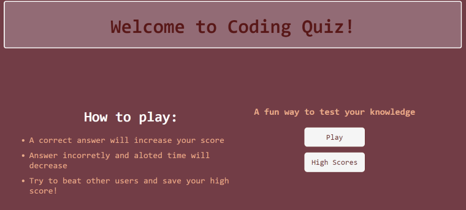
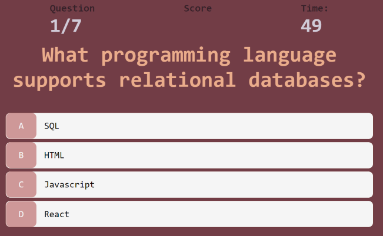

# Code Quiz 📝⌛
 

## Description
This is a quiz app! A multiple-choice quiz with a timer count. This app is mainly focused on using Javascript to further develop our skills.

## User Story
As a coding boot camp student I want to take a timed quiz on JavaScript fundamentals that stores high scores so that I can gauge my progress compared to my peers.

## Acceptance Criteria 
- When code quiz shows rules, then upon clicking start button a time starts and user is presented with a question. 
- After answering another question must be asked. 
- If user answers incorrectly time is subtracted from clock. 
- Game is over when all questions are answered or timer is 0. 
- User should be able to save initials and high score.

## Tools and Technologies
- Javascript
- HTML
- CSS

## Usage
> **To view my application**: Link Coming Soon [Link]()

## Mock Up

<!--  -->